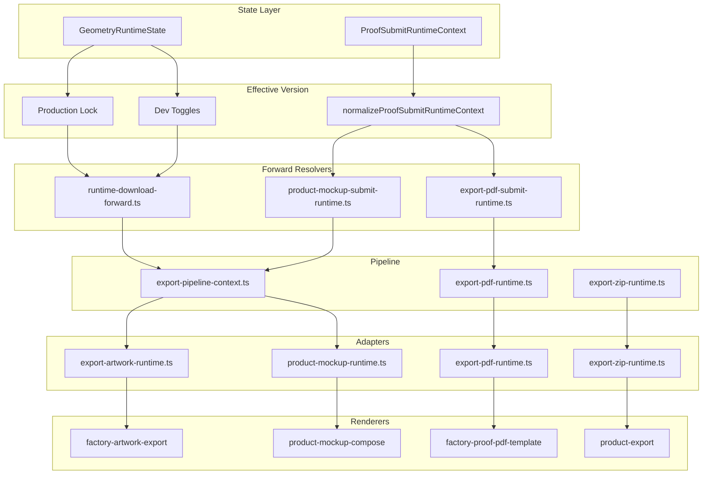

# Phase 74.0 — Geometry Runtime v2 Freeze

**Date:** 2026-07-23  
**Status:** FROZEN  
**Scope:** Documentation only — no code, runtime, placement, or render changes

---

## Freeze Declaration

Geometry Runtime v2 architecture is **complete and frozen** as of Phase 74.0.

Phases 71.x–73.x delivered:

- Single geometry owner (`resolveGeometryRuntimeSnapshot` → `export-runtime-snapshot`)
- Single `ExportPipelineContext` injection point
- Canonical forward resolvers for every runtime surface
- Download runtime (artwork, mockup, ZIP, PDF)
- Submit runtime (PDF, mockup)
- Product Mockup, PDF, ZIP, and Artwork runtime adapters
- Regression coverage and client/server separation

**No new runtime features, placement changes, or geometry changes are permitted without a new phase and explicit unfreeze.**

---

## 1. Final Runtime Architecture

### Layered pipeline (mandatory for every surface)

```
┌─────────────────────────────────────────────────────────────────┐
│                     GeometryRuntimeState                        │
│  (geometryVersion, preview toggles, exportRuntime toggles)     │
└────────────────────────────┬────────────────────────────────────┘
                             │
                             ▼
┌─────────────────────────────────────────────────────────────────┐
│                     Effective Version                           │
│  production lock + dev toggle + submit normalization            │
│  resolveEffectiveGeometryVersion / normalizeProofSubmit...      │
└────────────────────────────┬────────────────────────────────────┘
                             │
                             ▼
┌─────────────────────────────────────────────────────────────────┐
│                     Forward Resolver                            │
│  ONE per surface/path — owns version + pipeline resolution only │
└────────────────────────────┬────────────────────────────────────┘
                             │
                             ▼
┌─────────────────────────────────────────────────────────────────┐
│                   ExportPipelineContext                         │
│  geometryVersion, snapshot, geometry, visualCompensation,       │
│  photoBridge — immutable after resolution                       │
└────────────────────────────┬────────────────────────────────────┘
                             │
                             ▼
┌─────────────────────────────────────────────────────────────────┐
│                     Runtime Adapter                             │
│  Reads pipelineContext only — delegate, no geometry ownership   │
└────────────────────────────┬────────────────────────────────────┘
                             │
                             ▼
┌─────────────────────────────────────────────────────────────────┐
│                        Renderer                                 │
│  Produces artifact bytes — no geometry recalculation            │
└─────────────────────────────────────────────────────────────────┘
```

### Submit wire (additional context layer)

Submit paths carry **versions only** on the wire — not geometry snapshots:

```
GeometryRuntimeState
  → resolveProofSubmitRuntimeContext()     [client]
  → ProofSubmitRuntimeContext JSON         [FormData: proofRuntimeContext]
  → normalizeProofSubmitRuntimeContext()   [server]
  → Forward Resolver (pdf / mockup)
  → ExportPipelineContext (rebuilt server-side)
```

### Mermaid — full export/submit topology



---

## 2. Approved Runtime Owners

### State ownership

| Concern | Owner module | Key API |
|---------|--------------|---------|
| **Runtime state (client)** | `geometry-runtime-state.ts` | `createDefaultGeometryRuntimeState`, `resolveEffectiveGeometryVersion`, `isGeometryRuntimeProductionLocked` |
| **Runtime context (React)** | `geometry-runtime-context.tsx` | `GeometryRuntimeProvider`, `useGeometryRuntime` |
| **Submit wire context** | `proof-submit-runtime-context.ts` | `resolveProofSubmitRuntimeContext`, `normalizeProofSubmitRuntimeContext` |
| **Submit bridge (client)** | `ProofSubmitRuntimeContextBridge.tsx` | Serializes context to FormData |

### Geometry ownership

| Concern | Owner module | Rule |
|---------|--------------|------|
| **Geometry snapshot** | `resolve-geometry-runtime.ts` | Single geometry owner — `resolveGeometryRuntimeSnapshot` |
| **Export snapshot delegate** | `export-runtime-snapshot.ts` | Delegates to geometry owner only |
| **Photo bridge** | `geometry-runtime-photo-bridge.ts` | Resolved inside pipeline context |
| **Builder / anchor / calibration** | `geometry-builder.ts`, `product-factory-anchor.ts`, `geometry-calibration.ts` | **Frozen** — adapters must not call |

### PipelineContext ownership

| Concern | Owner module | Key API |
|---------|--------------|---------|
| **Canonical pipeline context** | `export-pipeline-context.ts` | `resolveExportPipelineContext` |
| **Surface wrappers** | `export-pdf-runtime.ts`, `export-zip-runtime.ts` | `resolvePdfExportPipelineContext`, `resolveZipExportPipelineContext` |

### Forward ownership

| Surface / path | Owner module | Key API |
|----------------|--------------|---------|
| Download artwork | `runtime-download-forward.ts` | `resolveArtworkRuntimeForwardFromEffectiveVersion` |
| Download mockup | `runtime-download-forward.ts` | `resolveProductMockupRuntimeForwardFromEffectiveVersion` |
| Download ZIP | `runtime-download-forward.ts` | `resolveZipRuntimeForwardFromEffectiveVersion` |
| Download PDF | `export-pdf-submit-runtime.ts` | `resolveProofPdfRuntimeForwardFromEffectiveVersion` |
| Submit PDF | `export-pdf-submit-runtime.ts` | `resolveProofPdfRuntimeForward` |
| Submit mockup | `product-mockup-submit-runtime.ts` | `resolveProofMockupRuntimeForward` |
| Download orchestration | `geometry-runtime-export.ts` | Orchestration only — no pipeline resolution |
| PDF server entry | `geometry-runtime-export-pdf.server.ts` | Server-only PDF download |

### Adapter ownership

| Surface | Owner module | Key API | Reads |
|---------|--------------|---------|-------|
| Artwork export | `export-artwork-runtime.ts` | `resolveArtworkExportRuntimeGeometry` | `pipelineContext.geometry`, `pipelineContext.snapshot` |
| Product mockup | `product-mockup-runtime.ts` | `resolveProductMockupRuntimePlacement` | `pipelineContext.photoBridge`, `visualCompensation` |
| ZIP bundle | `export-zip-runtime.ts` | `resolveZipExportRuntimeInput` | Passthrough `pipelineContext` |
| PDF proof | `export-pdf-runtime.ts` | `resolvePdfExportRuntimeLayout` | `pipelineContext.geometry`, `snapshot` |

### Renderer ownership

| Surface | Renderer module | Entry function |
|---------|-----------------|----------------|
| Artwork PNG | `factory-artwork-export.ts` | `renderProductFactoryArtworkPng` |
| Mockup PNG (download) | `ProductMockupEngine.ts` → `product-mockup-compose.ts` | `renderProductMockupOnProduct` → `composeProductMockup` |
| Mockup PNG (submit V1) | `mockup-export.ts` | `renderMockupPreviewPng` |
| Mockup PNG (submit V2) | `product-mockup-submit-render.ts` | `renderProofSubmitProductMockupPng` |
| ZIP bundle | `product-export.ts` | `buildProductExportFiles` |
| PDF proof | `factory-proof-pdf-template.ts` | Factory proof page render |
| Print PNG | `print-export-system` | **Frozen V1** — not runtime-migrated |

---

## 3. Architecture Rules

These rules are **binding** for all future work under the frozen architecture.

### Version resolution

1. **No module except forward resolvers may resolve effective geometry versions for export surfaces.**
   - Allowed: `runtime-download-forward.ts`, `export-pdf-submit-runtime.ts`, `product-mockup-submit-runtime.ts`, `proof-submit-runtime-context.ts` (submit normalization), `geometry-runtime-state.ts` (UI effective version).
   - Not allowed: adapters, renderers, orchestration layers, UI components.

2. **No runtime surface may bypass a forward resolver.**
   - `geometry-runtime-export.ts` must delegate to `runtime-download-forward.ts`.
   - Submit paths must use `resolveProofPdfRuntimeForward` / `resolveProofMockupRuntimeForward`.

3. **Approved `resolveExportPipelineContext` call sites are frozen:**

   | Module | Purpose |
   |--------|---------|
   | `export-pipeline-context.ts` | Canonical implementation |
   | `runtime-download-forward.ts` | Download artwork/mockup forward |
   | `export-zip-runtime.ts` | ZIP surface wrapper |
   | `export-pdf-runtime.ts` | PDF surface wrapper |
   | `product-mockup-submit-runtime.ts` | Submit mockup forward |
   | `export-artwork-runtime.ts` | Shadow compare log only |

### Geometry and placement

4. **No renderer recalculates geometry.**
   Renderers consume adapter output or pre-resolved placement rects only.

5. **No adapter owns geometry.**
   Adapters read `ExportPipelineContext` fields; they do not call Builder, Factory Anchor, or `resolveGeometryRuntimeSnapshot`.

6. **No placement changes inside adapters without a new geometry phase.**
   Placement authority: `product-mockup-runtime.ts`, `export-pdf-runtime.ts`, `export-artwork-runtime.ts`.

7. **`ExportPipelineContext` is immutable after forward resolution.**
   Forward produces context; downstream code reads it. No mutation of `snapshot`, `geometry`, or `photoBridge` in adapters or renderers.

### Client / server boundary

8. **No client component imports server modules.**
   - PDF: `geometry-runtime-export-pdf.server.ts` (uses `node:fs` via proof template chain).
   - Client imports: specific modules (`geometry-runtime-export.ts`, `proof-submit-runtime-context.ts`), not the `index.ts` barrel if it re-exports server symbols.

9. **No client imports:** `node:fs`, `node:path`, `generateProofPdf`, `factory-proof-pdf-template`, `generate-proof.ts`.

### Shadow compare

10. **Shadow compare is log-only.**
    Env-gated `console.info`; no image mutation, no geometry mutation, no alternate render path.

---

## 4. Extension Rules

Future features **must** follow the frozen pipeline. No exceptions.

### Adding a new export surface

```
New export surface
        │
        ▼
Forward resolver (new function in dedicated forward module)
        │
        ▼
resolveExportPipelineContext(surface: "<new-surface>")
        │
        ▼
Runtime adapter (new or existing — reads pipelineContext only)
        │
        ▼
Renderer (produces artifact)
```

**Checklist for new surfaces:**

1. Add `GeometryExportSurface` type entry if needed (`geometry-runtime-types.ts`).
2. Add dev toggle in `GeometryExportRuntimeToggles` if user-facing.
3. Create forward function: `resolve<Surface>RuntimeForwardFromEffectiveVersion`.
4. Create adapter in `export-<surface>-runtime.ts` — delegate only.
5. Wire orchestration entry (download and/or submit forward).
6. Add regression: `export-<surface>-runtime.regression.ts`.
7. Update `phase-73.1-runtime-forward-map.md` successor doc.
8. **Do not** call `resolveExportPipelineContext` from renderer or orchestration.

### Adding submit support for an existing surface

1. Add `effectiveVersions.<surface>` to `ProofSubmitRuntimeContext`.
2. Create submit forward: `resolveProof<Surface>RuntimeForward(order, proofRuntimeContext)`.
3. Reuse download adapter and renderer — same `pipelineContext` shape.
4. Regression: submit forward == download forward for same effective version.

### Explicitly out of scope without unfreeze

- Geometry core changes (`geometry-builder`, `product-factory-anchor`, `calibration.json`)
- PhotoBridge internals
- Print export runtime migration
- New placement implementations outside adapters
- Inline `resolveExportPipelineContext` in any orchestration module

---

## 5. Production Gates

### Current state (frozen)

| Gate | Mechanism | Effect |
|------|-----------|--------|
| **Production lock** | `isGeometryRuntimeProductionLocked()` → `NODE_ENV === "production"` | All surfaces resolve to V1 in production |
| **Dev toggles** | `exportRuntime.png`, `.zip`, `.pdf` | Per-surface V2 requires toggle ON + non-production |
| **Preview toggles** | `preview.designer`, `preview.resultPanel` | Designer/result panel V2 preview |
| **Submit normalization** | `normalizeProofSubmitRuntimeContext` | Server re-applies production lock to wire context |

### Effective version resolution paths

| Path | Resolver |
|------|----------|
| Download (UI) | `getEffectiveGeometryVersion(surface)` → forward `FromEffectiveVersion` |
| Submit (client) | `resolveProofSubmitRuntimeContext` → forward with `proofRuntimeContext` |
| Submit (server) | `normalizeProofSubmitRuntimeContext` → forward |

### Future production enable (not in scope for freeze)

To enable V2 in production, a future phase must explicitly:

1. Change or remove production lock policy (not just dev toggles).
2. Run full regression baseline (Section 6) with zero export-runtime failures.
3. Resolve snapshot drift (`product-factory-anchor`, `geometry-factory-origin-calibration`).
4. Update stale `export-pipeline-context.regression.ts` assertion.
5. End-to-end visual QA per surface with shadow compare in staging.
6. Document rollback plan (re-lock to V1 via production lock).

**Until then, production behavior remains V1 on all surfaces.**

---

## 6. Regression Baseline

Recorded **2026-07-23** as Geometry Runtime v2 baseline.

**Run all export/runtime suites:**

```bash
npx tsx lib/designer-geometry-v2/runtime-forward-canonicalization.regression.ts
npx tsx lib/designer-geometry-v2/export-artwork-runtime.regression.ts
npx tsx lib/designer-geometry-v2/product-mockup-runtime.regression.ts
npx tsx lib/designer-geometry-v2/export-zip-runtime.regression.ts
npx tsx lib/designer-geometry-v2/export-pdf-runtime.regression.ts
npx tsx lib/designer-geometry-v2/export-pdf-submit-runtime.regression.ts
npx tsx lib/designer-geometry-v2/product-mockup-submit-runtime.regression.ts
npx tsx lib/designer-geometry-v2/proof-submit-runtime-context.regression.ts
npx tsx lib/designer-geometry-v2/export-runtime-snapshot.regression.ts
npx tsx lib/designer-geometry-v2/geometry-v2-release-candidate.regression.ts
```

### Tier 1 — Runtime v2 export (release gate)

| Suite | Baseline | Checks |
|-------|----------|--------|
| `runtime-forward-canonicalization.regression.ts` | ✅ PASS | 19 |
| `export-artwork-runtime.regression.ts` | ✅ PASS | 51 |
| `product-mockup-runtime.regression.ts` | ✅ PASS | 37 |
| `export-zip-runtime.regression.ts` | ✅ PASS | 28 |
| `export-pdf-runtime.regression.ts` | ✅ PASS | 29 |
| `export-pdf-submit-runtime.regression.ts` | ✅ PASS | 19 |
| `product-mockup-submit-runtime.regression.ts` | ✅ PASS | 18 |
| `proof-submit-runtime-context.regression.ts` | ✅ PASS | 18 |
| `export-runtime-snapshot.regression.ts` | ✅ PASS | 74 |
| `geometry-v2-release-candidate.regression.ts` | ✅ ALL PASS | — |

**Tier 1 score: 9/9 export runtime suites fully green.**

### Tier 2 — Pipeline plumbing

| Suite | Baseline | Notes |
|-------|----------|-------|
| `export-pipeline-context.regression.ts` | ⚠️ 50/51 | Stale assertion: PDF template now reads `pipelineContext` (71.4 by design) |

### Tier 3 — Foundation / guard suites

| Suite | Baseline | Notes |
|-------|----------|-------|
| `geometry-runtime-switch.regression.ts` | ✅ PASS | Production lock guard |
| `designer-runtime-geometry.regression.ts` | ✅ PASS | |
| `designer-template-runtime.regression.ts` | ✅ PASS | |
| `geometry-builder.regression.ts` | ✅ PASS | |
| `geometry-calibration.regression.ts` | ✅ PASS | |
| `geometry-overlay.regression.ts` | ✅ PASS | |
| `geometry-v2-back-alignment.regression.ts` | ✅ PASS | |
| `shadow-render.regression.ts` | ✅ PASS | |
| `shadow-runtime.regression.ts` | ✅ PASS | |
| `product-master.regression.ts` | ⚠️ PASS WITH STABILITY WARNING | 0 violations |
| `designer-geometry-v2.regression.ts` | ❌ FAIL | Intentional V2 wiring in render paths |
| `geometry-debug.regression.ts` | ❌ FAIL | Debug overlay in render tree |
| `product-factory-anchor.regression.ts` | ❌ FAIL | Frozen snapshot drift |
| `geometry-factory-origin-calibration.regression.ts` | ❌ FAIL | Front stage snapshot drift |

**Tier 3 failures are pre-existing and outside runtime adapter scope. They do not block the architecture freeze; they block production V2 enable.**

---

## 7. Production Readiness Checklist

### Architecture freeze (complete)

- [x] Single geometry owner (`resolveGeometryRuntimeSnapshot`)
- [x] Single `ExportPipelineContext` injection point
- [x] Canonical forward resolver per runtime surface
- [x] Download runtime (artwork, mockup, ZIP, PDF)
- [x] Submit runtime (PDF, mockup)
- [x] Client/server separation (PDF server module isolated)
- [x] Shadow compare log-only on all surfaces
- [x] Regression coverage for export runtime (Tier 1: 9/9 PASS)
- [x] Forward canonicalization (Phase 73.1)
- [x] Freeze documentation (this document)

### Production V2 enable (not complete)

- [ ] Lift or replace production lock policy
- [ ] Per-surface production toggle strategy defined
- [ ] Fix stale `export-pipeline-context` regression assertion
- [ ] Resolve `product-factory-anchor` snapshot drift
- [ ] Resolve `geometry-factory-origin-calibration` snapshot drift
- [ ] Print submit runtime migration (if required)
- [ ] End-to-end staging QA with `EXPORT_PRODUCT_RUNTIME_COMPARE=true`
- [ ] Download PDF UI wired to `generateProofPdfWithGeometryRuntime` (optional)
- [ ] Rollback runbook documented

---

## Reference Documents

| Phase | Document |
|-------|----------|
| 71.2 | `phase-71.2-product-mockup-audit.md` |
| 71.3 | `phase-71.3-zip-bundle-audit.md` |
| 71.4 | `phase-71.4-pdf-export-audit.md` |
| 71.5 | `phase-71.5-email-runtime-audit.md` |
| 72.1 | `phase-72.1-submit-pipeline-runtime-audit.md` |
| 72.3 | `phase-72.3-pdf-submit-cutover-audit.md` |
| 72.4 | `phase-72.4-product-mockup-submit-audit.md` |
| 73.0 | `phase-73.0-geometry-runtime-stabilization-audit.md` |
| 73.1 | `phase-73.1-runtime-forward-map.md` |
| **74.0** | **`phase-74.0-runtime-freeze.md`** (this document) |

---

## Unfreeze Policy

To modify frozen architecture:

1. Open a new phase (e.g. 75.x) with explicit scope.
2. State which frozen rule(s) are being changed and why.
3. Add or update regression coverage before merge.
4. Update this document and `phase-73.1-runtime-forward-map.md`.

**Geometry Runtime v2 is frozen. Extension proceeds only through the forward → pipeline → adapter → renderer pipeline.**
