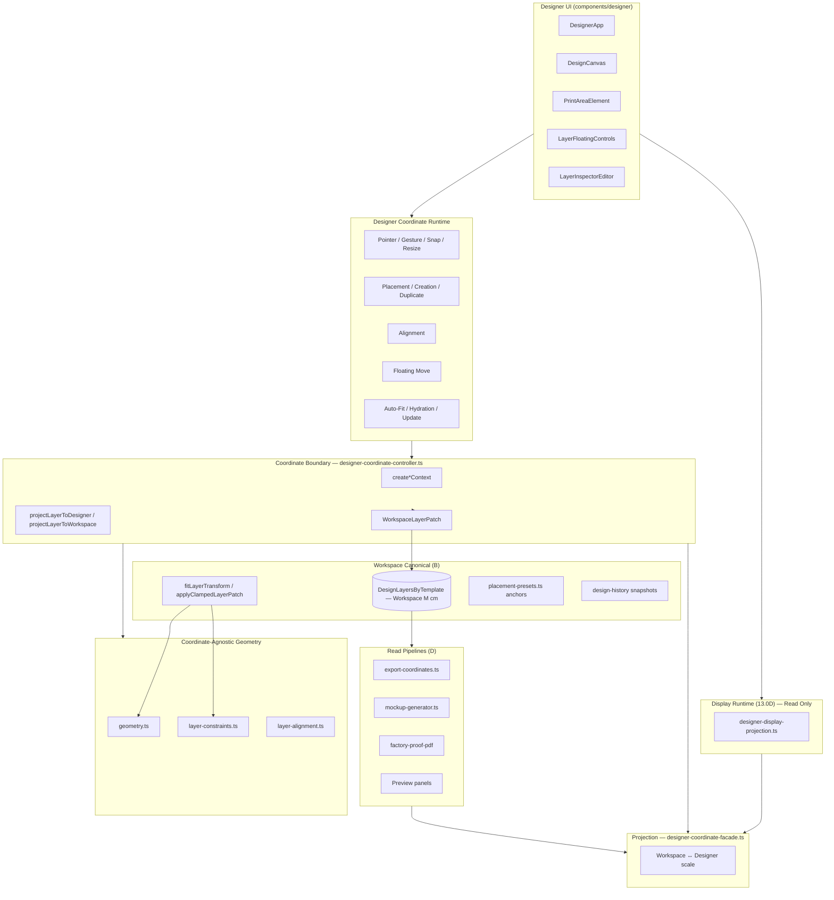

# Designer Coordinate Runtime — Final Architecture Audit

**Step 13.0N** · Read-only audit · No runtime changes  
**Date:** 2026-06-08  
**Status:** Architecture Freeze Candidate

---

## Executive Summary

Designer Coordinate Runtime Migration (Steps 13.0C–13.0M) is **complete**. All interactive **Designer write paths** route through `lib/designer-coordinate-controller.ts`. Storage remains **Workspace M canonical**. Geometry (`geometry.ts`, `layer-constraints.ts`, `layer-alignment.ts`) is **coordinate-agnostic**.

Remaining Workspace coordinate usage is **intentional** and classified as Canonical Boundary, Display, or Read Pipeline.

---

## Runtime Architecture Diagram



### Write Path (Canonical)

```
Designer Pointer / Inspector / Toolbar / Hydration
        ↓
Designer Coordinate (current garment printable area)
        ↓
designer-coordinate-controller
        ↓
WorkspaceLayerPatch / Workspace Layer
        ↓
setLayers() → DesignLayersByTemplate (Workspace M)
        ↓
Read Pipelines (Export / Preview / Factory)
```

---

## Dependency Graph

```
components/designer/
├── DesignerApp.tsx ──────────────► designer-coordinate-controller (primary write hub)
│                                   layer-constraints (applyClampedLayerPatch only)
│                                   designer-workspace (workspace print area read)
├── PrintAreaElement.tsx ─────────► designer-coordinate-controller (drag/resize/snap)
│                                   designer-coordinate-facade (types, display CSS)
│                                   geometry (fitLayerTransform post-clamp)
├── DesignCanvas.tsx ─────────────► designer-coordinate-controller (snap targets)
│                                   designer-display-projection (CSS % display)
│                                   layer-alignment (guide preview only)
├── LayerFloatingControls.tsx ────► designer-coordinate-controller (floating move)
├── LayerInspectorEditor.tsx ─────► designer-coordinate-controller (inspector writes)
│                                   designer-display-projection (inspector display)
└── InspectorObjectCard.tsx ──────► designer-coordinate-controller + display-projection

lib/
├── designer-coordinate-controller.ts
│       └── designer-coordinate-facade.ts
│       └── layer-constraints.ts (fit*Layer in designer space)
│       └── layer-alignment.ts (alignDesignLayers in designer space)
│       └── geometry.ts (applyDragSnap in designer space)
│       └── placement-presets.ts (via applyDesignerPlacementPreset)
├── designer-coordinate-facade.ts
│       └── designer-workspace.ts
│       └── garment-anchor-runtime.ts
├── designer-display-projection.ts
│       └── designer-coordinate-facade.ts (read only)
├── geometry.ts ──────────────────► (no designer-coordinate imports)
├── layer-constraints.ts ─────────► geometry.ts only
├── layer-alignment.ts ───────────► layer-constraints.ts only
├── placement-presets.ts ─────────► layer-constraints.ts (workspace M anchors)
└── proof-engine/ export-coordinates/ coordinates/ ─► Storage read (Workspace M)
```

---

## Runtime Classification Table

| ID | Runtime | Location | Class | Coordinate | Rationale |
|----|---------|----------|-------|------------|-----------|
| W-01 | Layer storage | `lib/types.ts` `DesignLayer.*_cm` | **B** | Workspace M | Canonical storage schema |
| W-02 | `setLayers` auto-fit | `DesignerApp.tsx` | **A→Controller** | Designer→Workspace | `fitDesignerLayers(designerFitContext)` |
| W-03 | `updateLayer` | `DesignerApp.tsx` | **A→Controller** | Designer→Workspace | `updateDesignerLayer` |
| W-04 | Draft hydration | `hydrateDesignLayersByTemplate` | **A→Controller** | Designer→Workspace | `hydrateDesignerLayers` |
| W-05 | Gender change fit | `handleGenderChange` | **A→Controller** | Designer→Workspace | `fitDesignerLayers` per side/size |
| W-06 | Canvas drag | `PrintAreaElement.tsx` | **A→Controller** | Designer→Workspace | `applyDesignerDragSnap` → patch |
| W-07 | Canvas resize | `PrintAreaElement.tsx` | **A→Controller** | Designer→Workspace | `resolveDesignerHandleResizeWorkspacePatch` |
| W-08 | Snap targets | `DesignCanvas` / `PrintAreaElement` | **A→Controller** | Designer | `buildDesignerSnapTargetsFromLayers` |
| W-09 | Placement / creation | `DesignerApp.tsx` | **A→Controller** | Designer→Workspace | `createDesigner*Layer` APIs |
| W-10 | Alignment write | `DesignerApp.handleAlignLayers` | **A→Controller** | Designer→Workspace | `applyDesignerLayerAlignment` |
| W-11 | Floating toolbar move | `LayerFloatingControls.tsx` | **A→Controller** | Designer→Workspace | `applyDesignerFloatingMove` |
| W-12 | Inspector writes | `LayerInspectorEditor.tsx` | **A→Controller** | Designer→Workspace | `applyDesignerLayerPatch` etc. |
| W-13 | Gesture transform | `DesignerApp.applyClampedLayerTransform` | **A→Controller + B** | Mixed | Controller resolves patch; `applyClampedLayerPatch` workspace clamp |
| W-14 | Post-snap clamp | `PrintAreaElement.applyWorkspacePosition` | **B** | Workspace M | `fitLayerTransform(printArea)` intentional final clamp |
| W-15 | Placement preset anchors | `placement-presets.ts` | **B** | Workspace M | Frozen preset geometry; entry via `applyDesignerPlacementPreset` |
| W-16 | Alignment guide preview | `DesignCanvas.handleAlign` | **C** | Workspace M | `getAlignmentGuidesForSelection(printArea)` display only; writes via W-10 |
| W-17 | Grid / guides display | `PrintAreaGrid`, `ElementAlignmentGuides` | **C** | Designer | `designerPrintableArea` CSS % |
| W-18 | Layer CSS display | `designer-display-projection` | **C** | Designer | Read-only CSS % from workspace storage |
| W-19 | Constraint overlay | `CurrentGarmentConstraintVisualization` | **C** | Workspace+Garment ratio | Status display |
| W-20 | Export coordinates | `lib/export-coordinates.ts` | **D** | Workspace M | Read pipeline from storage |
| W-21 | Mockup generator | `proof-engine/generators/mockup-generator.ts` | **D** | Workspace M | Read pipeline |
| W-22 | Factory PDF | `proof-engine/generators/factory-proof-pdf-template.ts` | **D** | Garment anchor | Read pipeline |
| W-23 | Design history | `design-history.ts` | **B** | Workspace M | Snapshots of storage layers |
| W-24 | Live design state | `live-design-state.ts` | **C** | Workspace M read | Inspector display derivation |

### Category Legend

| Class | Name | Description |
|-------|------|-------------|
| **A** | Designer Runtime | Interactive writes; **must** use Controller → all migrated ✅ |
| **B** | Workspace Canonical | Intentional Workspace M; storage, clamp, presets, history |
| **C** | Display Runtime | Visual only; no storage writes |
| **D** | Read Pipeline | Export, preview, factory; reads canonical storage |

---

## Workspace Runtime Audit

### Remaining Workspace Runtime (Canonical + Display + Read)

See classification table W-01 through W-24. All remaining workspace coordinate usage falls into categories **B**, **C**, or **D** with documented rationale.

### Category D — Read Pipelines

| Runtime | File | Coordinate |
|---------|------|------------|
| Export coordinates | `lib/export-coordinates.ts` | Workspace M from storage |
| Mockup generator | `proof-engine/generators/mockup-generator.ts` | Workspace M layers |
| Factory PDF | `proof-engine/generators/factory-proof-pdf-template.ts` | Garment anchor read |
| Preview panels | `PreviewInfoPanel.tsx` | Display projection read |

Read pipelines **never write** storage. They consume canonical Workspace M layers and apply garment/export transforms at render time.

### Intentional Workspace Usage (Category B — Keep)

| Runtime | File | Why it stays |
|---------|------|--------------|
| Storage fields `x_cm`, `y_cm`, `width_cm`, `height_cm` | `lib/types.ts` | Canonical Workspace M contract |
| `getDesignerWorkspacePrintAreaCm` | `lib/designer-workspace.ts` | Fixed M reference frame for storage↔display scale |
| `fitLayerTransform` post-snap | `PrintAreaElement.tsx` | Final workspace clamp after designer snap projection |
| `applyClampedLayerPatch` | `DesignerApp.tsx` | Gesture snap+clamp in workspace space after controller patch |
| `placement-presets.ts` anchors | `lib/placement-presets.ts` | Preset definitions frozen in workspace M; controller wraps entry |
| `buildSnapTargetsFromLayers` (gesture path) | `DesignerApp.tsx` | Workspace snap targets for `applyClampedLayerPatch` |
| History snapshots | `lib/design-history.ts` | Stores workspace layers verbatim |

### Display-Only Workspace Usage (Category C — Keep)

| Runtime | File | Why it stays |
|---------|------|--------------|
| `getAlignmentGuidesForSelection(..., printArea)` | `DesignCanvas.tsx` | Preview guides only; alignment **writes** use controller (13.0K) |
| `workspacePrintArea` constraint viz | `garment-constraint-*.ts` | Ratio overlay: garment vs fixed workspace frame |
| Legacy `toCssPercent` fallback | `PrintAreaElement.tsx` | Fallback when `displayPercentStyle` absent |

### No Remaining Category A Gaps

Audit scan confirms **zero** direct `fitTextLayer` / `fitImageLayer` / `fitShapeLayer` / `fitDesignLayers` / `alignDesignLayers` calls in `components/designer/DesignerApp.tsx`.  
**Zero** direct `workspaceRectToDesignerRect` / `designerRectToWorkspaceRect` in designer write components.

---

## Controller API Inventory (Write Boundary)

| Step | Domain | Key APIs |
|------|--------|----------|
| 13.0E | Inspector | `applyDesignerLayerPatch`, `setLayerDesigner*` |
| 13.0F | Drag | `clientPixelDeltaToDesignerCm`, `resolveDesignerDragWorkspacePatch` |
| 13.0G | Resize | `clientPointToDesignerCm`, `resolveDesignerHandleResizeWorkspacePatch` |
| 13.0H | Placement | `createDesignerUploadPlacement`, `createDesignerDefault*Layer` |
| 13.0I | Snap | `applyDesignerDragSnap`, `buildDesignerSnapTargetsFromLayers` |
| 13.0J | Gesture | `resolveWorkspaceGestureForApplyClamped`, `resolveDesignerGestureResizeWorkspacePatch` |
| 13.0K | Alignment | `applyDesignerLayerAlignment` |
| 13.0L | Floating | `applyDesignerFloatingMove` |
| 13.0M | Fit/Hydration | `fitDesignerLayers`, `updateDesignerLayer`, `hydrateDesignerLayers` |

**Rule:** Controller returns `WorkspaceLayerPatch` or Workspace `DesignLayer` — never exposes Designer layers to UI storage boundary.

---

## Layer Isolation Verification

| Module | Imports designer-coordinate? | Status |
|--------|------------------------------|--------|
| `geometry.ts` | No | ✅ Coordinate-agnostic |
| `layer-constraints.ts` | No | ✅ Coordinate-agnostic |
| `layer-alignment.ts` | No | ✅ Coordinate-agnostic |
| `placement-presets.ts` | No | ✅ Workspace M presets |
| `direct-manipulation.ts` | No | ✅ Handle math only |
| `designer-coordinate-facade.ts` | — | ✅ Pure projection, no React/DOM |
| `designer-coordinate-controller.ts` | Facade only | ✅ Pure functions, no React/DOM |
| `designer-display-projection.ts` | Facade only | ✅ Read-only display |

---

## Migration Timeline (13.0C–13.0M)

| Step | Scope | Status |
|------|-------|--------|
| 13.0C | Facade projection | ✅ |
| 13.0D | Display projection | ✅ |
| 13.0E | Inspector writes | ✅ |
| 13.0F | Canvas drag | ✅ |
| 13.0G | Canvas resize | ✅ |
| 13.0H | Placement / creation | ✅ |
| 13.0I | Snap | ✅ |
| 13.0J | Gesture | ✅ |
| 13.0K | Alignment | ✅ |
| 13.0L | Floating controls | ✅ |
| 13.0M | Auto-fit / hydration | ✅ |
| 13.0N | Architecture audit | ✅ |

---

## Architecture Conclusion

### Success Criteria

| Criterion | Result |
|-----------|--------|
| All Designer Runtime writes migrated | ✅ |
| Workspace Runtime has documented rationale | ✅ |
| No undiscovered Designer write gaps | ✅ |
| Controller = sole coordinate write boundary | ✅ |
| Storage Canonical = Workspace M | ✅ |
| Geometry coordinate-agnostic | ✅ |
| Architecture ready to freeze | ✅ |

### Freeze Declaration

The Designer Coordinate architecture is **frozen** as of Step 13.0N.

Future changes must:
1. Route all new interactive writes through `designer-coordinate-controller.ts`
2. Keep `geometry.ts` / `layer-constraints.ts` coordinate-agnostic
3. Not add designer fields to storage schema
4. Treat remaining workspace usage in categories B/C/D as intentional unless a new migration step is approved

### Optional Future Work (Out of Scope for 13.0N)

| Item | Class | Notes |
|------|-------|-------|
| Alignment guide preview → designer space | C | Cosmetic; writes already correct |
| Gesture `applyClampedLayerPatch` full designer snap | A+B | Would require layer-constraints designer snap path |
| Export pipeline garment projection | D | Separate read-pipeline enhancement |

---

## Validation

Run: `node scripts/validate-designer-runtime-audit-13-0n.mjs`

Checks: boundary isolation, DesignerApp write audit, storage schema, regression 13.0F–13.0M.
