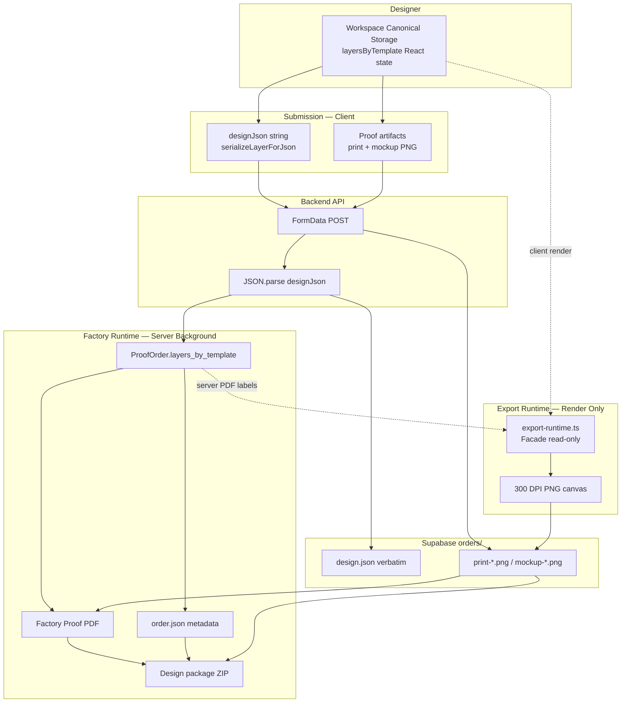

# Phase 16.0 — Production Runtime Audit (Factory Pipeline Verification)

**Date:** 2026-07-03  
**Scope:** Audit only — no Runtime, UI, Storage, or Coordinate modifications.

**Validation:** `node scripts/validate-production-runtime-16-0.mjs` → **PASS**

---

## Executive Summary

| Stage | Workspace Canonical? | Re-project at stage? | Verdict |
|-------|---------------------|----------------------|---------|
| Designer state | ✅ Source of truth | Write via Controller (design time) | ✅ |
| Submission `designJson` | ✅ Direct field copy | ❌ No | ✅ PASS |
| Supabase `design.json` | ✅ Verbatim upload | ❌ No | ✅ PASS |
| Server `ProofOrder` | ✅ From parsed JSON | ❌ No | ✅ PASS |
| Client print/mockup PNG | ✅ Reads workspace fields | ✅ Render: Facade → garment cm → 300 DPI px | ✅ Expected |
| Factory PDF labels | ✅ `order.layers_by_template` | ✅ `export-runtime` at label time | ✅ Expected |
| Factory PDF mockup image | Pre-rendered PNG bytes | Scale to PDF pt only | ✅ Baked at client |
| `order.json` | Metadata only | ❌ No layer coords | ✅ |
| ZIP package | Same artifact set | ❌ No re-render | ✅ |

**Conclusion:** The production pipeline uses **one Workspace Canonical dataset** flowing from Designer → Submission → Supabase → Factory. Physical projection (Facade read-only) occurs **only at render/label time**, never baked into submission JSON.

---

## Production Pipeline Diagram



---

## Layer-by-Layer Audit

| Layer | Runtime | Re-project? | Re-size coords? | Data source |
|-------|---------|-------------|-----------------|-------------|
| Designer Workspace | Controller → Workspace M | On write | — | User interaction |
| Submission JSON | `export-design.ts` | ❌ | ❌ | `layer.x_cm` … direct |
| Backend API | `app/api/designs/submit` | ❌ | ❌ | Parsed `designJson` |
| Supabase | `uploadSubmissionFiles` | ❌ | ❌ | Raw string + PNG buffers |
| Export PNG | `print-export-system` | ✅ Facade → garment | ✅ cm → px @ 300 DPI | Workspace fields in layers |
| Mockup PNG | `mockup-export` | ✅ Facade → garment | ✅ cm → template px | Workspace fields |
| Factory PDF (labels) | `factory-proof-pdf-template` | ✅ `mapLiveDesignElementsToExportPhysical` | Garment cm for display | `order.layers_by_template` |
| Factory PDF (image) | embed uploaded PNG | ❌ | PDF pt scale only | Client-rendered bytes |
| order.json | `order-json.ts` | ❌ | ❌ | Order metadata |
| ZIP | `design-package-zip.ts` | ❌ | ❌ | Pre-built buffers |

---

## 1. Data Source Audit

### Server-side Factory Runtime

| Source | Used? |
|--------|-------|
| Submission JSON (`designJson` → `layersByTemplate`) | ✅ **Yes** |
| Designer React memory (server) | ❌ No |
| Preview Runtime | ❌ No |
| Designer Display Runtime | ❌ No |

```153:163:app/api/designs/submit/route.ts
    const proofOrder: ProofOrder = {
      order_id: orderId,
      submission_no: submissionNo,
      gender: templateType as ProofOrder["gender"],
      active_side: side,
      shirt_color: shirtColor,
      size,
      layers_by_template: config.layersByTemplate,
      applicant,
      created_at: createdAt,
    };
```

### Client-side artifact generation (pre-upload)

Uses **same `layersByTemplate` object reference** as `buildFullDesignJson` in `DesignerApp.tsx` — not re-parsed from JSON string. Equivalent to submission content at submit instant.

---

## 2. Export Entry Audit

| Output | File | Function | Called from | Data source |
|--------|------|----------|-------------|-------------|
| Print PNG 300 DPI | `lib/print-export-system.ts` | `renderPrintExportPng` | `proof-engine/generators/print-generator.ts` | Workspace layer fields |
| Mockup PNG | `lib/mockup-export.ts` | `renderMockupPreviewPng` | `mockup-generator.ts`, contest submit | Workspace layer fields |
| Factory PDF | `factory-proof-pdf-template.ts` | `generateFactoryProofPdf` | `proof-pdf-generator.ts` → `generateProofDocuments` | `ProofOrder` + uploaded PNGs |
| order.json | `order-json.ts` | `buildOrderJson` | `generateProofDocuments` | Order metadata (no layer coords) |
| ZIP | `design-package-zip.ts` | `buildDesignPackageZip` | `generateProofDocuments` | PDF + JSON + PNG buffers |
| Contest preview | `mockup-export.ts` | `renderMockupPreviewPng` | `DesignerApp` contest branch | Workspace layers |
| Draft preview.png | image blob | — | `syncDraftToServer` | Original image preview blob |

---

## 3. Workspace Consistency

Factory / Export read workspace canonical fields:

```20:24:lib/export-runtime.ts
function readExportWorkspaceLayerCmRect(layer: DesignLayer): LayerCmRect {
  if (layer.type === "text") {
    return getTextLayerCmRect(layer);
  }
  return getLayerEffectiveCmRect(layer);
}
```

**Not used in production pipeline:**

- Preview CSS %
- Designer Display CSS %
- DOM position / screen px
- `preview-runtime.ts`

---

## 4. Physical Projection Audit

### Allowed (render-time only)

```
Workspace Storage (x_cm, y_cm, width_cm, height_cm)
        ↓
export-runtime → designer-coordinate-facade (read-only)
        ↓
Garment Blue cm @ size
        ↓
coordinate-runtime mapLayerCmRect
        ↓
300 DPI PNG pixels
```

### Forbidden in JSON path (verified absent)

```
Workspace → Physical Projection → JSON  ❌ NOT DONE
```

`serializeLayerForJson` does not import or call `export-runtime`, `preview-runtime`, or display projection.

---

## 5. PNG Verification — A4 21 × 29.7 cm

| Check | Result |
|-------|--------|
| Garment physical cm @ all 14 sizes × front/back | ✅ 28/28 — always 21 × 29.7 |
| 300 DPI pixel width | ✅ 2480 px = `(21 / 2.54) × 300` |
| 300 DPI pixel height | ✅ 3508 px = `(29.7 / 2.54) × 300` |
| Screen / DOM size influence | ❌ None — `cmToPhysicalExportPx` from garment cm |

Layer **pixel placement** on canvas uses `resolveExportGarmentLayerCmRect` + linear map — not preview screen coordinates.

---

## 6. PDF Verification

| Panel | Coordinate source | Projection |
|-------|-------------------|------------|
| Left info (sizes, positions) | `order.layers_by_template` | `mapLiveDesignElementsToExportPhysical` → garment cm |
| Right mockup | Uploaded `mockup-*.png` | Pixel bake from client export path |
| Print area overlay | `getDesignerPrintAreaCmBounds(side, size)` | Layout math in PDF pt |

Rotation and scale in PNG render come from `layer.rotation` / `layer.scale` on workspace layer — unchanged by submission.

---

## 7. ZIP Verification

`buildDesignPackageZip` contents:

| File | Source |
|------|--------|
| `{submissionNo}-proof.pdf` | Generated from same `ProofOrder` + artifacts |
| `order.json` | `buildOrderJson(order, …)` |
| `validation-report.json` | `buildValidationReport(order, …)` |
| `mockup-front.png` / `mockup-back.png` | Client artifacts |
| `print-front.png` / `print-back.png` | Client artifacts |
| `original-*.png` | Optional upload |

**Informational:** `design.json` is stored at `orders/{submissionNo}/design.json` via `uploadSubmissionFiles` but **is not bundled inside the ZIP**. All ZIP binaries derive from the same submit `ProofOrder` + artifact set.

---

## 8. Multi-size Verification

14 sizes × front/back:

- A4 garment export cm: **21 × 29.7** at every size ✅
- Export garment fingerprint stable across sizes ✅
- `order.size` carried in `ProofOrder` and `order.json`

Workspace storage scales per size; physical garment cm preserved via Facade (Phase 14.2.2 behavior).

---

## 9. Color Verification

10 shirt colors tested — workspace production fingerprint **unchanged**.

Color affects:

- `shirt_color` in `ProofOrder` / mockup template tint
- Garment mockup PNG rendering

Color does **not** affect:

- `x_cm`, `y_cm`, `width_cm`, `height_cm`, `rotation`, `scale` in storage or submission JSON

---

## 10. Production Fingerprint

```javascript
// SHA-256 (first 16 hex) over sorted layer records:
{ id, type, x_cm, y_cm, width_cm, height_cm, rotation, scale, zIndex }
```

| Comparison | Result |
|------------|--------|
| Designer workspace === Submission JSON | ✅ `33306323a792d774` (identical) |
| Export garment fingerprint | ✅ Stable 28/28 (deterministic Facade projection) |
| PNG ↔ PDF labels | ✅ Same `export-runtime` projection functions |

**Note:** Workspace fingerprint ≠ Export garment fingerprint when `size ≠ M` — expected (Facade maps M workspace → size garment). Submission JSON intentionally stores workspace canonical values.

---

## 11. Dependency Audit

### Factory / Export pipeline — must NOT depend on:

| Dependency | Found? |
|------------|--------|
| `preview-runtime.ts` | ❌ No |
| `PreviewGarmentView` / `PreviewDesignLayer` | ❌ No |
| `designer-display-projection` | ❌ No |
| `designer-display-scale` | ❌ No |
| `designer-coordinate-controller` | ❌ No |
| React state (server) | ❌ No |

### Allowed read-only dependency:

| Module | Role |
|--------|------|
| `designer-coordinate-facade` | Workspace → Garment cm (via `export-runtime`) |
| `designer-coordinate-facade` | Read-only at export/factory time |

---

## Findings (No blocking issues)

### F-16.0-1 — Client PNG bake before server persist

| | |
|---|---|
| **Root cause** | `generateProofArtifacts` runs in browser before `fetch`, using React state |
| **Impact** | PNG pixels fixed at submit instant; server cannot re-render from layers |
| **Risk** | Low — same `layersByTemplate` object used for `designJson` and `proofOrder` |
| **Frozen runtime?** | No change needed for canonical architecture |
| **Suggested phase** | 16.0.1 — optional server-side PNG regeneration from stored `design.json` |

### F-16.0-2 — `design.json` not inside ZIP

| | |
|---|---|
| **Root cause** | `buildDesignPackageZip` omits `design.json` |
| **Impact** | ZIP consumers need separate Supabase fetch for full layer JSON |
| **Minimal fix** | Add `design.json` to ZIP in `design-package-zip.ts` |
| **Frozen?** | Touches proof-engine only (not coordinate runtimes) |

### F-16.0-3 — PDF left panel uses fixed `getGarmentMaxPrintAreaCm` for one label

| | |
|---|---|
| **Root cause** | `factory-proof-pdf-template.ts` references fixed 35×50 / 38×45 for max print label |
| **Impact** | Display label only; element sizes use size-aware `getDesignerPrintAreaCmBounds` |
| **Suggested phase** | 16.0.2 — align max-print label with size-aware garment blue |

### F-16.0-4 — Not implemented

Checkout, Request Quote, client Create Order — out of scope.

---

## Dependency Graph

```
                    ┌─────────────────────┐
                    │ Workspace Canonical │
                    │  layersByTemplate   │
                    └─────────┬───────────┘
                              │
           ┌──────────────────┼──────────────────┐
           ▼                  ▼                  ▼
   serializeLayerForJson   export-runtime    (Designer UI — frozen)
           │              (render only)            │
           ▼                  │                     │
      design.json             │                     │
           │                  ▼                     │
           │            print/mockup PNG            │
           ▼                  │                     │
      Supabase ◄──────────────┘                     │
           │                                        │
           ▼                                        │
      ProofOrder ──────► Factory PDF labels         │
           │              (export-runtime)          │
           └──────────────► order.json (meta)       │
                          ZIP / Email               │
```

---

## Validation & Regression

```bash
node scripts/validate-production-runtime-16-0.mjs
```

| Check | Result |
|-------|--------|
| Designer → Submission fingerprint | PASS |
| Submission → Supabase wiring | PASS |
| Supabase → Export projection path | PASS |
| Export → 300 DPI PNG spec (A4) | PASS |
| Export → Factory PDF projection | PASS |
| PNG ↔ PDF shared export-runtime | PASS |
| 14 sizes × front/back A4 cm | 28/28 PASS |
| 10 colors | PASS |
| ZIP wiring | PASS |
| Regression 15.4 / 15.2 | PASS |

---

## Conclusion

The full pipeline **Designer → Submission → Backend → Export → Factory PDF → PNG → ZIP** maintains **Workspace Canonical layer data** in all JSON persistence paths. Physical projection via **Export Runtime + Facade (read-only)** is correctly confined to **render and PDF label** stages and does not contaminate submission storage. Phase 14.x–15.x refactors did not break production data lineage.
