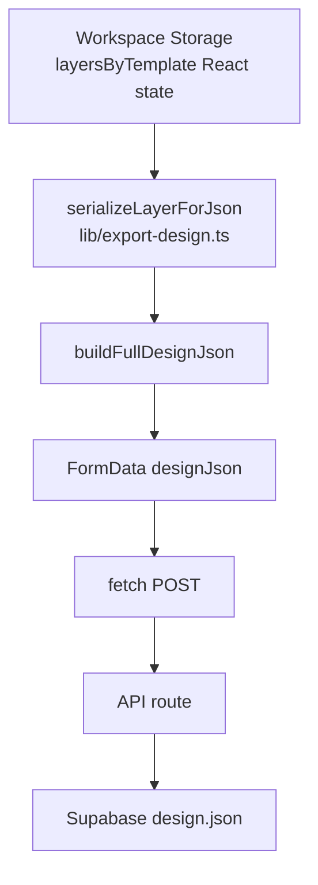

# Phase 15.4 — Submission Runtime Audit (Workspace Canonical Verification)

**Date:** 2026-07-03  
**Scope:** Audit only — no Runtime, UI, Storage, Projection, or API modifications.

**Validation:** `node scripts/validate-submission-runtime-15-4.mjs` → **PASS**

---

## Executive Summary

| Area | Verdict |
|------|---------|
| **Layer JSON payload (`designJson` / `layersByTemplate`)** | ✅ **Workspace Canonical** — coordinates read directly from `DesignLayer` storage |
| **Preview / Display Runtime in layer JSON path** | ✅ **None** |
| **Export / Display projection in layer JSON path** | ✅ **None** |
| **Proof / mockup PNG artifacts (parallel branch)** | ⚠️ Uses `print-export-system` / `mockup-export` — **does not alter `designJson`** |
| **Backend receive** | ✅ Stores client `designJson` verbatim |
| **Checkout / Quote / Create Order (client)** | ❌ **Not implemented** |

Phase 14.x–15.x refactors **did not break** Workspace Canonical submission for layer coordinates. Submission still flows:

```
Layer (React state / Workspace Storage)
        ↓
serializeLayerForJson() — direct field copy
        ↓
buildFullDesignJson(layersByTemplate, …)
        ↓
FormData.designJson
        ↓
fetch(POST)
        ↓
API route JSON.parse → storage / DB
```

---

## 1. Submission Entry Points

| # | UI Label | File | Function | HTTP | API URL | Payload Source |
|---|----------|------|----------|------|---------|----------------|
| 1 | 確認發送申請 | `components/designer/DesignerApp.tsx` | `handleSubmitConfirm` (normal) | POST | `/api/designs/submit` | `buildFullDesignJson(layersByTemplate)` + proof PNG artifacts |
| 2 | 確認投稿 | `components/designer/DesignerApp.tsx` | `handleSubmitConfirm` (contest) | POST | `/api/contest/submit` | `buildDesignJson(gender, side, slotLayers)` per side |
| 3 | Auto draft (30s) | `components/designer/DesignerApp.tsx` | `syncDraftToServer` | POST | `/api/designs/draft` | `buildFullDesignJson(layersByTemplate)` |
| 4 | Local draft | `components/designer/DesignerApp.tsx` | `persistDraftLocally` | — | IndexedDB | `layersByTemplateToDraftSnapshot()` |
| 5 | 確認送出申請 | `components/pro-upload/ProUploadPanel.tsx` | `handleSubmit` | POST | `/api/pro-upload/submit` | Uploaded file + case metadata (**no canvas layers**) |
| 6 | Factory proof (background) | `app/api/designs/submit/route.ts` | `after(generateProofDocuments)` | — | Supabase `orders/` | Server-side PDF/ZIP from stored files |

**Not found:** Checkout, Request Quote, client Create Order, Save Draft button, Server Actions (`"use server"`).

---

## 2. Payload Source Audit

### Layer JSON path (canonical)



**Source of truth:** `layersByTemplate` in `DesignerApp` state — same object used by canvas, undo/redo, and draft persistence.

`serializeLayerForJson` copies workspace fields only:

```74:88:lib/export-design.ts
function serializeLayerForJson(layer: DesignLayer) {
  const base = {
    id: layer.id,
    name: layer.name,
    type: layer.type,
    visible: layer.visible,
    locked: layer.locked,
    zIndex: layer.zIndex,
    x_cm: layer.x_cm,
    y_cm: layer.y_cm,
    width_cm: layer.width_cm,
    height_cm: layer.height_cm,
    scale: layer.scale,
    rotation: layer.rotation,
  };
```

**No calls to:** `workspaceRectToDesignerRect`, `getLayerDesignerDisplayCssPercent`, `previewGarmentRectToPhysicalStyle`, `resolveExportGarmentLayerCmRect`, `mapWorkspaceLayerCmRectToGarmentPrintArea`.

### Parallel artifact path (non-canonical JSON, by design)

Normal submit **also** generates proof PNGs **before** upload:

```
layersByTemplate
        ↓
buildProofOrder → prepareProofSubmission → generateProofArtifacts
        ↓
mockup-export / print-export-system (Export projection for rendering)
        ↓
FormData proof-mockup-* / proof-print-*  (binary, separate from designJson)
```

`designJson` is built **before** `prepareProofSubmission` in `DesignerApp.tsx` — artifacts cannot mutate the JSON string.

---

## 3. Layer Payload Fields

### Image layer (JSON)

| Field | Source |
|-------|--------|
| `id`, `name`, `type`, `visible`, `locked`, `zIndex` | Workspace |
| `x_cm`, `y_cm`, `width_cm`, `height_cm` | Workspace |
| `rotation`, `scale` | Workspace |
| `fileName`, `mimeType` | Workspace (`layer.image`) |

**Excluded from JSON:** `originalBlob`, `previewUrl`, `originalUrl` (binary / object URLs stay in FormData `original` or IndexedDB).

### Text layer (JSON)

`text`, `fontSize_cm`, `fontFamily`, `color`, `opacity`, `fontWeight`, `fontStyle`, `letterSpacing_cm`, `lineHeight`, `textAlign`, `stroke`, `shadow`, `keepRatio` + base cm fields.

### Shape layer (JSON)

`shapeKind`, `fill`, `stroke`, `strokeWidth_cm`, `opacity` + base cm fields.

### Forbidden in layer objects (verified absent)

`preview*`, `display*`, `designer*`, `css*`, `left%`, `top%`, `width%`, `height%`, `px` position fields.

### Document-level meta (not layer projection)

`buildFullDesignJson` adds:

- `version`, `templateType`, `side`, `activeGender`, `activeSide`
- `submissionMeta`: `size`, `shirtColor`, `fit`, `material`, `gender`, body metrics, `applicant`
- `export` / `exportBySide`: **fixed M production export metadata** via `getExportMeta()` — describes PNG export spec, **does not transform layer coordinates**

---

## 4. Coordinate Verification

| Check | Result |
|-------|--------|
| `x_cm`, `y_cm`, `width_cm`, `height_cm` in payload === workspace state | ✅ PASS |
| Designer Display projection in submission | ❌ Not used |
| Preview projection in submission | ❌ Not used |
| Export projection in **layer JSON** | ❌ Not used |
| Physical / garment cm remap in **layer JSON** | ❌ Not used |

**Note:** Workspace coordinates are **size-invariant by design** (M workspace canonical storage). `size` is carried in document meta (`submissionMeta.size`), not re-written into per-layer `x_cm`/`y_cm` at submit time. This matches pre–Phase 15 architecture.

---

## 5. Size Audit (14 sizes)

Validated: `90`, `110`, `130`, `150`, `160`, `GS`, `GM`, `GL`, `S`, `M`, `L`, `XL`, `XXL`, `XXXL`.

| Field | Behavior |
|-------|----------|
| `meta.size` | ✅ Present in payload for all sizes |
| Layer `x_cm` / `y_cm` / `width_cm` / `height_cm` | ✅ Unchanged across sizes (workspace canonical) |
| `export.printAreaCm` in meta | Fixed adult spec (metadata only) |

**28/28** size × side payload parity checks passed in validation script.

---

## 6. Front / Back Audit

| Check | Result |
|-------|--------|
| `layersByTemplate[gender].front` | ✅ Separate array |
| `layersByTemplate[gender].back` | ✅ Separate array |
| Contest submit | ✅ `buildDesignJson` per `DESIGN_SIDES` with correct `side` |
| Active side in meta | ✅ `activeSide` / `side` from current designer tab |
| All layers forced to one side | ❌ Not observed |

---

## 7. Color Audit

| Check | Result |
|-------|--------|
| `shirtColor` in `submissionMeta` | ✅ Only meta field changes |
| Layer position / size / rotation on color change | ✅ Invariant (4/4 colors tested) |
| Workspace storage on color change | ✅ `setShirtColor` only — layers untouched |

---

## 8. Preview Independence (Layer JSON path)

Files on layer JSON path audited:

- `lib/export-design.ts`
- `components/designer/DesignerApp.tsx` (JSON builders only)
- `app/api/designs/submit/route.ts`
- `app/api/designs/draft/route.ts`
- `app/api/contest/submit/route.ts`
- `lib/contest-submission.ts`

| Forbidden import | Found on layer JSON path? |
|------------------|---------------------------|
| `preview-runtime.ts` | ❌ No |
| `PreviewGarmentView` | ❌ No |
| `PreviewDesignLayer` | ❌ No |
| `designer-display-scale.ts` | ❌ No |
| `designer-display-projection.ts` | ❌ No |

`DesignerApp` imports `mockup-export` for **contest preview PNG** and proof artifacts — parallel to `designJson`, not inside `serializeLayerForJson`.

---

## 9. Export Independence (Layer JSON path)

| Forbidden on layer JSON path | Found? |
|------------------------------|--------|
| `export-runtime.ts` | ❌ No |
| `designer-display-projection.ts` | ❌ No |
| `designer-display-scale.ts` | ❌ No |

| Module | Layer JSON path | Artifact branch |
|--------|-----------------|-----------------|
| `print-export-system.ts` | ❌ Not used by `serializeLayerForJson` | ✅ Proof print PNG |
| `mockup-export.ts` | ❌ Not used by `serializeLayerForJson` | ✅ Proof / contest preview PNG |
| `export-runtime.ts` | ❌ Not in submission client | Used inside export stack for rendering |

**Finding (informational, not a canonical breach):** Normal submit pre-generates export-projected PNGs for factory proof. These are **separate FormData fields**; `designJson` layer coordinates remain workspace canonical.

---

## 10. Backend Receive Audit

### `POST /api/designs/submit`

1. Parses `designJson` string → `config.layersByTemplate`
2. Passes `config.layersByTemplate` **as-is** into `ProofOrder.layers_by_template`
3. Uploads original `designJson` string to storage (`uploadSubmissionFiles`)
4. DB insert: `template_type`, `side`, `shirt_color`, `size` from parsed meta

**No server-side coordinate reprojection** on `layersByTemplate`.

### `POST /api/designs/draft`

Uploads `designJson` buffer directly to `drafts/{id}/design.json`.

### `POST /api/contest/submit`

Stores `frontDesignJson` / `backDesignJson` per side — each built from `buildDesignJson` (workspace layers for that slot).

### Expected backend JSON shape (normal submit, excerpt)

```json
{
  "version": 2,
  "templateType": "male",
  "side": "front",
  "activeGender": "male",
  "activeSide": "front",
  "size": "M",
  "shirtColor": "white",
  "layersByTemplate": {
    "male": {
      "front": [{ "id": "…", "x_cm": 5, "y_cm": 8, "width_cm": 10, "height_cm": 10, "rotation": 15, "scale": 1, … }],
      "back": [ … ]
    },
    "female": { "front": [], "back": [] }
  }
}
```

---

## 11. HTTP Response Audit

| Route | Success | Error | Format |
|-------|---------|-------|--------|
| `/api/designs/submit` | 200 `{ submissionNo, orderId, proofProcessing }` | 400 / 500 `{ error }` | `NextResponse.json` |
| `/api/designs/draft` | 200 `{ draftId, savedAt, expiresAt }` | 400 / 500 `{ error }` | `NextResponse.json` |
| `/api/contest/submit` | 200 `{ submissionNo, authorName }` | 400 / 500 `{ error }` | `NextResponse.json` |
| `/api/pro-upload/submit` | 200 `{ submissionNo }` | 400 / 500 `{ error }` | `NextResponse.json` |

All routes use `NextResponse.json` — no HTML redirect responses in submit handlers.  
`Unexpected token '<'` would indicate wrong URL / middleware / 404 page — not observed in route source.

---

## 12. Runtime Dependency Audit

### Layer JSON submission may depend on:

- ✅ `layersByTemplate` (Workspace Storage state)
- ✅ `lib/export-design.ts` (serialization only)
- ✅ `lib/design-state.ts` (slot iteration)
- ✅ `lib/types.ts` (Layer model)
- ✅ `lib/text-layer.ts` (`serializeTextLayer` for `texts.json`)

### Layer JSON submission must NOT depend on (verified):

- ✅ Preview Runtime
- ✅ Designer Display Runtime
- ✅ Export Runtime (for coordinates)
- ✅ Coordinate projection facades

---

## Findings & Recommendations

### No blocking issues

Workspace Canonical submission for **layer coordinates** is intact after Phase 14.x–15.x.

### Informational findings

| ID | Finding | Impact | Fix scope |
|----|---------|--------|-----------|
| F-15.4-1 | Proof PNGs use Export Runtime (`print-export-system`, `mockup-export`) at submit time | Binary artifacts only; `designJson` unaffected | None required for canonical JSON; document in factory pipeline |
| F-15.4-2 | `getExportMeta()` in `designJson` uses fixed M production print spec | Metadata only; not layer coords | Optional Phase: size-aware export meta in JSON |
| F-15.4-3 | `order.json` (server background) uses `print-export-system` for DPI/pixel dimensions | Order summary only | Out of submission JSON scope |

### If a future phase needs changes

| Phase | Scope | Touches frozen? |
|-------|-------|-----------------|
| **15.4.1** | Document / test proof artifact vs JSON coordinate parity | No runtime change |
| **15.4.2** | Size-aware `export` meta in `designJson` (optional) | `export-design.ts` only |
| **15.4.3** | Move proof generation server-side only | API + proof-engine |

---

## Validation & Regression

```bash
node scripts/validate-submission-runtime-15-4.mjs
```

| Check | Result |
|-------|--------|
| Workspace → Payload coordinates | PASS |
| 14 sizes × Front/Back | 28/28 PASS |
| Color invariance | 4/4 PASS |
| Preview independence (layer JSON) | PASS |
| Export independence (layer JSON) | PASS |
| Backend verbatim storage | PASS |
| Regression 15.2 / 15.3.4 / 15.3.5 | PASS |

---

## Dependency Graph

```mermaid
flowchart TB
  subgraph canonical [Workspace Canonical — Layer JSON]
    L[DesignLayer state]
    E[export-design.serializeLayerForJson]
    B[buildFullDesignJson]
    J[designJson string]
    L --> E --> B --> J
  end

  subgraph artifacts [Parallel — Proof Artifacts]
  L2[layersByTemplate]
  P[proof-engine client]
  M[mockup-export]
  X[print-export-system]
  PNG[proof PNG blobs]
  L2 --> P --> M --> PNG
  P --> X --> PNG
  end

  subgraph api [API]
    J --> SUBMIT[/api/designs/submit]
    PNG --> SUBMIT
    SUBMIT --> S3[(Supabase Storage)]
  end

  subgraph frozen [Untouched by 15.4]
    PR[Preview Runtime 15.x]
    DR[Display Runtime 13.0D]
    ER[Export Runtime 15.2]
  end

  PR -.->|not in JSON path| J
  DR -.->|not in JSON path| J
  ER -.->|artifact render only| PNG
```

---

**Conclusion:** Submission Pipeline layer coordinates remain **100% Workspace Canonical**. Phase 14.x–15.x Designer / Preview / Export refactors did not inject display, preview, or export projection into `designJson` / `layersByTemplate`.
